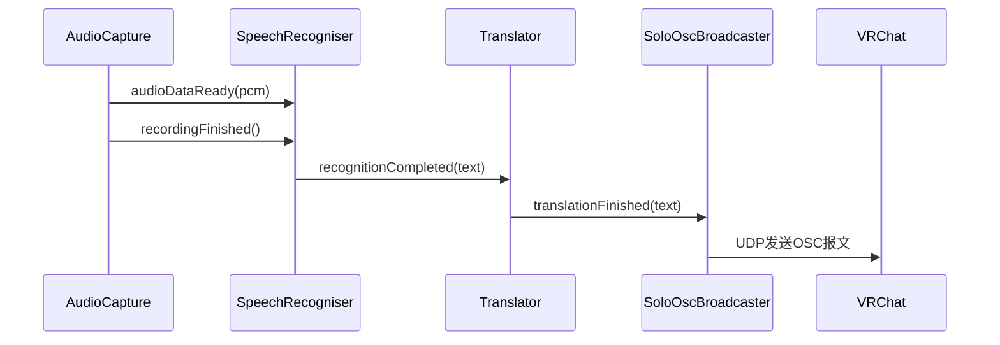

# VRCEasyTrans
一个基于 C++ Qt 框架的实时翻译软件，轻量化实现实时的普通话/英语的语音识别+多种目标语言的翻译，专为 VRchat 虚拟现实社交平台设计。


### 项目特色

- 超低延迟 - C++ 原生实现，响应速度比 Python 版本快 5-10 倍
- 轻量高效 - 内存占用仅 15~17 MB，CPU占用率 0.1% ~ 0.3% ，启动时间 < 0.3秒
- 精准识别 - 集成优化的语音识别引擎，目前可识别中文普通话和英文
- 多语言翻译 - 使用 DeepSeek API 实时翻译

### 软件性能(对比 python 版本)

对比 PyQt6(Python)，C++ Qt 提升：
- 启动时间 1.2-2.0 秒  → 0.1-0.3 秒, 6倍
- 内存占用 80-150 MB   → 20-40 MB, 4倍
- 按钮响应 15-40 ms    → 1-5 ms, 8倍
- 语音识别 200-500 ms  → 50-150 ms, 3倍
- 包大小 ~200 MB       → ~15 MB, 13倍

#
#
# 📦 下载

- 本软件为免安装软件，使用手册参考下载的压缩包中的内容。
- 点击进入下载页面：[VRChatEasyTrans-1.0.2](https://github.com/Rosa-11/VRChatEasyTrans/releases/tag/1.0.2)

### ⚠️ 免责声明
- 用户应对使用本软件生成、传输的内容承担全部责任。本软件仅作为工具提供技术服务，不对用户间交流内容的合法性、适当性负责。
- 禁止用户将本软件用于违反法律法规的活动、侵犯他人权益的行为、商业机密窃取、任何非法监控或窃听、重要信息的记录与决策。软件和软件的开发者不承担任何责任。
- 本软件设计目为用户个人使用，没有对个人信息进行加密存储，因此请勿将程序本体直接进行复制和转发，这会造成你的API密钥泄露。
- 因转发程序本体或电脑信息泄露等意外造成的API泄露、财产损失等后果，软件和软件的开发者不承担任何责任。

#
#

# 🔧开发者
### 流程图

```
|
├── 语音捕获、分割
├── 音频数据编码、提交语音识别模型API
├── 得到的中文文本，提交翻译模型API
├── 得到的外文文本，打包成OSC发送到VRChat
├── 文本翻译显示
V

其中主窗口类和AudioCapture类的方法运行于主线程，SpeechRecogniser、Translator、SoloOscBroadcaster三个类的方法分别运行于各自的线程，通过信号与槽机制进行通信，总计一个主线程和三个子线程。
请务必仔细阅读main.cpp中提到的各个对象的实例化顺序！！ConfigManager依赖主应用类，其余工作类和主窗口类均依赖ConfigManager
```

### 技术栈/模块

- 前端界面: Qt6 Widgets + QML
- 语音识别: 讯飞星火（流式调用）
- 文本翻译: Deepseek
- 音频采集: Qt Multimedia
- 网络通信: Qt Network (HTTP/OSC)
- 线程管理: QTreadPool
- 配置管理: 静态管理类 + 配置文件
- 构建系统: CMake
- 编译器: mingw_32

--------------------------------------------------
### 构建与使用

系统要求

- 操作系统: Windows 10/11, macOS 10.14+, Ubuntu 18.04+
- 编译器: C++17 兼容编译器
- 依赖: Qt6.0+, CMake 3.16+

快速开始

1. 克隆项目
   ```bash
   git clone https://github.com/Rosa-11/VRCEasyTrans.git
   ```
2. 构建项目（使用 Qt Creator 直接点击构建即可）
   ```bash
   mkdir build && cd build
   cmake ..
   cmake --build . --config Release
   ```

VRchat 设置

1. 在 VRchat 中启用 OSC：
   · 设置 → 搜索 OSC → 启用 OSC
   · 默认端口：9000
2. 在 VRCEasyTrans 中的配置：
   · OSC 主机：127.0.0.1
   · OSC 端口：9000


### 类图

项目结构

```
src/
├── main.cpp              # 程序入口（主线程）
├── MainWindow/           # 主窗口类（主线程）
├── AudioCapture/         # 音频采集（主线程）
├── SpeechRecogniser/     # 语音识别（子线程）
├── Translator/           # 翻译服务（子线程）
└── ConfigManager/        # 配置管理（单例加锁访问）
```

时序图


计划实现的功能（优先级由高到低）

1. 可配置的接入除中英文以外其他语言的语音识别API的方案
2. 讯飞星火和 Deepseek 的websocket连接复用（两次调用之间加心跳包维持连接）
3. 接入可识别中文方言的API


# 🤝 参与贡献

本项目欢迎各种形式的贡献！
本人是学生平时比较忙，如果开启 pull request 很久没有合并或评论可以发送邮件至1375803462@qq.com提醒


# 📞 支持与反馈

如果您遇到问题或有建议：

1. 查看或提交新的 Issues
2. 邮箱: 1375803462@qq.com
3. VRChat: 影沫Rosa
---
